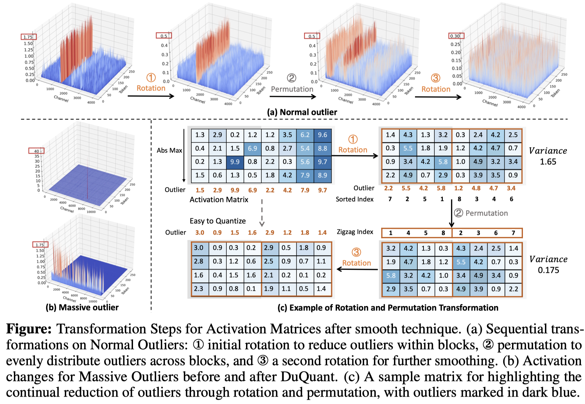
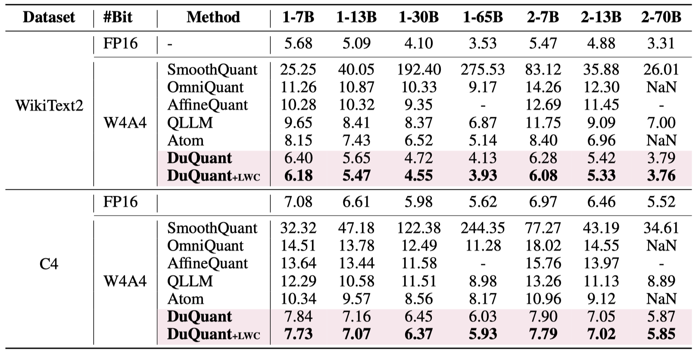

# DuQuant: Distributing Outliers via Dual Transformation Makes Stronger Quantized LLMs

<h5 align="center">

[](https://arxiv.org/abs/2406.01721)
[](https://duquant.github.io)
[](https://github.com/Hsu1023/DuQuant/blob/main/LICENSE)
 <br>

</h5>

Welcome to the official code repository for "[DuQuant: Distributing Outliers via Dual Transformation Makes Stronger Quantized LLMs **(NeurIPS 2024, Oral)**](https://arxiv.org/abs/2406.01721)".

🔍 For more details, please refer to the project page: [https://duquant.github.io/](https://duquant.github.io/).


## 📰 News
* [2024/09/26] 🌟 Our DuQuant paper has been accepted for a Oral presentation at NeurIPS 2024 (only top 1% out of 15,671 submissions)! 🎉 Cheers!
* [2024/09/06] 🔥 We release the code!
* [2024/06/03] 🚀 Our paper is available on arXiv!


## 👀 Introduction


- We firstly identify **Massive Outliers** existence at the **down_proj** layer of FFN module in recent LLMs.
- DuQuant proposes to use **Rotation transformation** and **Permutation transformation** to effectively eliminate both massive and normal outliers.
- DuQuant establishs new **state-of-the-art** baselines for 4-bit weight-activation quantization across various model types and downstream tasks.


## 🔧 Installation
```bash
conda create -n duquant python=3.10 -y
conda activate duquant
git clone https://github.com/Hsu1023/DuQuant.git
pip install --upgrade pip 
pip install -r requirements.txt
```

## ⚙️ Usage
### 1. Preprocessing
```bash
python get_rot.py # need to be run only once for all models
python generate_act_scale_shift.py --model PATH_OF_MODEL # need to be run only once for each model (path can be hugging-face hub path or relative path)
```

### 2. Quantization
The bash script for `DuQuant` can be found in `run.sh`. You can choose the model to be quantized by providing model path after `--model` order. To evaluate `DuQuant + lwc` method, you can run `run_lwc.sh` script. In addition, you can add `--save_dir` to save the quantized models, and use `--resume` to reload the saved models. 


#### Explanation of arguments:
- `--model`: the local model path or huggingface format.
- `--wbits`: weight quantization bits.
- `--abits`: activation quantization bits.
- `--block_size`: the block size of rotation matrices.
- `--max_rotation_step`: the max greedy search steps of rotation transformation.
- `--permutation_times`: the time of permutation transformation.
- `--swc`: the ratio of weight clipping (enable without LWC operation).
- `--lac`: the ratio of activation clipping.
- `--lwc`: activate the Learnable Weight Clipping (LWC).
- `--epochs`: the training epochs of LWC.
- `--resume`: loading pre-trained DuQuant parameters.
- `--multigpu`: to inference larger network on multiple GPUs.
- `--save_dir`: saving the quantization model for further exploration.
- `--eval_ppl`: evaluating the perplexity of quantized models.
- `--tasks`: evaluating on the zero-shot tasks.
- `--eval_mmlu`: evaluating on the MMLU benchmarks.
- `--mmlu_data_dir`: data path of the MMLU benchmarks.
- `--eval_mtbench`: evaluating on the MT-Bench.


### 3. Model Zoo

Currently, we support LLaMA series (LLaMA 1, 2 and 3), Vicuna series, and Mistral models. 

| Models      | 7B/8B | 13B  | 30B  | 65B/70B |
| ----------- | ----- | ---- | ---- | ------- |
| LLaMA1      | ✅     | ✅    | ✅    | ✅       |
| LLaMA2      | ✅     | ✅    | ---  | ✅       |
| LLaMA3      | ✅     | ---  | ---  | ✅       |
| Vicuna-v1.5 | ✅     | ✅    | ---  | ---     |
| Mistral     | ✅     | ---  | ---  | ---     |

## 📜 Result

- DuQuant achieves SoTA performance in PPL evaluation under W4A4 quantization.


- DuQuant showcases robustness towards LLaMA3-8B quantization.


## 📂 Contact
For immediate queries or further information, please open an issue or contact <xuhb20@mails.tsinghua.edu.cn> or <haokun.lin@cripac.ia.ac.cn>.

## 🙏 Acknowledgement
This repo is built upon the following projects:

* [OmniQuant](https://github.com/OpenGVLab/OmniQuant)
* [IntactKV](https://github.com/ruikangliu/IntactKV)
* [EAGLE](https://github.com/SafeAILab/EAGLE)
* [FastChat](https://github.com/lm-sys/FastChat)

We thank the authors for their code.

## 📝 Citation
We kindly request that you cite our work if you utilize the code or reference our findings in your research:
<!-- Please cite our work if you use our code or discuss our findings in your own research: -->
```
@article{lin2024duquant,
  title={DuQuant: Distributing Outliers via Dual Transformation Makes Stronger Quantized LLMs},
  author={Lin, Haokun and Xu, Haobo and Wu, Yichen and Cui, Jingzhi and Zhang, Yingtao and Mou, Linzhan and Song, Linqi and Sun, Zhenan and Wei, Ying},
  journal={arXiv preprint arXiv:2406.01721},
  year={2024}
}
